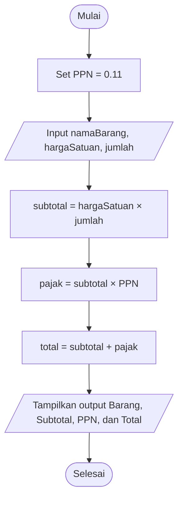

### Flowchart

```mermaid
flowchart TD
    A([Mulai]) --> B[Set PPN = 0.11]
    B --> C[/Input namaBarang, hargaSatuan, jumlah/]
    C --> D[subtotal = hargaSatuan × jumlah]
    D --> F[pajak = subtotal × PPN]
    F --> G[ total = subtotal + pajak]
    G --> H[/Tampilkan output Barang, Subtotal, PPN, dan Total/]
    H --> I([Selesai])
```
