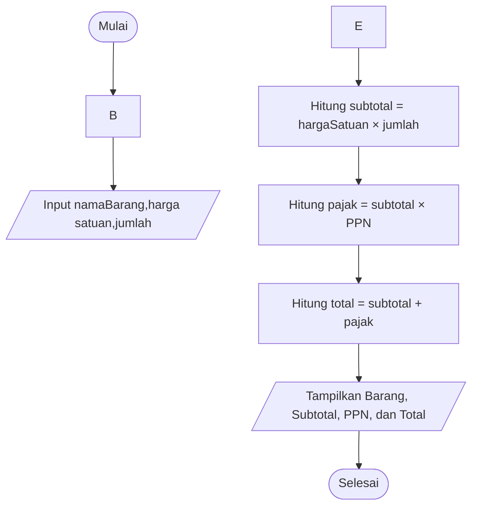

### Flowchart

```mermaid
flowchart TD
    A([Mulai]) --> 
    B --> C[/Input namaBarang,harga satuan,jumlah/]
    E --> F[Hitung subtotal = hargaSatuan × jumlah]
    F --> G[Hitung pajak = subtotal × PPN]
    G --> H[Hitung total = subtotal + pajak]
    H --> I[/Tampilkan Barang, Subtotal, PPN, dan Total/]
    I --> J([Selesai])
```
