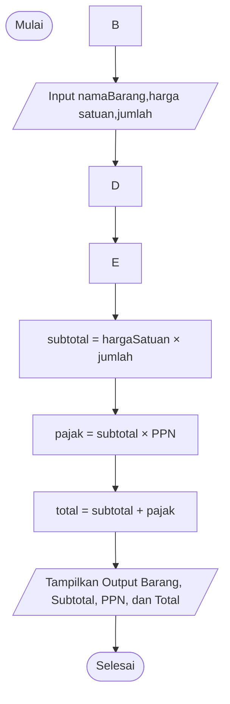

### Flowchart

```mermaid
flowchart TD
    A([Mulai]) 
    B --> C[/Input namaBarang,harga satuan,jumlah/]
    C --> D
    D --> E
    E --> F[ subtotal = hargaSatuan × jumlah]
    F --> G[ pajak = subtotal × PPN]
    G --> H[ total = subtotal + pajak]
    H --> I[/Tampilkan Output Barang, Subtotal, PPN, dan Total/]
    I --> J([Selesai])
```
